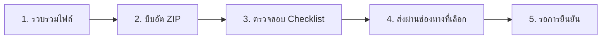

# 📮 คู่มือวิธีการส่งงาน - ESP32 Blynk Project

<div align="center">

## 📚 ME6831 - วิศวกรรมเครื่องกล
## 🏛️ มหาวิทยาลัยกาฬสินธุ์

---

### ✨ ขั้นตอนการส่งงานที่ง่ายและชัดเจน

</div>

---

## 🎯 วิธีการส่งงาน (เลือก 1 วิธี)

### 📧 วิธีที่ 1: ส่งผ่านอีเมล (แนะนำ)

<details open>
<parameter name="summary"><b>📩 ขั้นตอนการส่งผ่านอีเมล</b></summary>

#### ขั้นตอนที่ 1: เตรียมไฟล์

1. **รวบรวมไฟล์ทั้งหมด** ลงในโฟลเดอร์เดียว:
   ```
   ESP32_Blynk_[รหัสนักศึกษา]/
   ├── 📄 ESP32_[ชื่อ].ino
   ├── 📸 hardware_setup.jpg
   ├── 🖼️ dashboard_screenshot.png
   ├── 🖼️ datastreams_screenshot.png
   ├── 📊 serial_monitor.png
   ├── 📝 SUBMISSION.md
   └── 🎥 video_demo.mp4 (ถ้ามี)
   ```

2. **บีบอัดไฟล์เป็น ZIP**:
   - **Windows**: คลิกขวา → Send to → Compressed (zipped) folder
   - **Mac**: คลิกขวา → Compress
   - **Linux**: `zip -r ESP32_Blynk_65123456.zip ESP32_Blynk_65123456/`

3. **ตรวจสอบไฟล์**:
   - ✅ ชื่อไฟล์ถูกต้อง: `ESP32_Blynk_[รหัสนักศึกษา].zip`
   - ✅ ขนาดไฟล์ไม่เกิน 50MB
   - ✅ สามารถแตกไฟล์และเปิดได้

#### ขั้นตอนที่ 2: ส่งอีเมล

**ส่งไปที่:** `phoori.ja@ksu.ac.th` (หรืออีเมลที่อาจารย์กำหนด)

**หัวข้ออีเมล (Subject):**
```
[ME6831] ส่งงาน ESP32 Blynk - [รหัสนักศึกษา] - [ชื่อ-นามสกุล]
```

**ตัวอย่าง:**
```
[ME6831] ส่งงาน ESP32 Blynk - 65123456 - สมชาย ใจดี
```

**เนื้อหาอีเมล (ตัวอย่าง):**
```
เรียน อาจารย์ภูริ จันทิมา

ข้าพเจ้า นายสมชาย ใจดี รหัสนักศึกษา 65123456
ขอส่งงานสอบปฏิบัติ ESP32-S3 + Blynk IoT

รายละเอียดงาน:
- ชื่อโปรเจค: ESP32_สมชาย
- Blynk Template: ESP32S3_สมชาย
- Device Name: ESP32S3_PHOORI

ไฟล์แนบ: ESP32_Blynk_65123456.zip (ขนาด: XX MB)

ขอบคุณครับ/ค่ะ

สมชาย ใจดี
65123456
087-XXX-XXXX
```

</details>

---

### 💾 วิธีที่ 2: ส่งผ่าน Google Drive (สำหรับไฟล์ใหญ่)

<details>
<summary><b>☁️ ขั้นตอนการส่งผ่าน Google Drive</b></summary>

#### ขั้นตอนที่ 1: อัปโหลดไฟล์

1. เข้า [Google Drive](https://drive.google.com/)
2. สร้างโฟลเดอร์ใหม่: `ESP32_Blynk_[รหัสนักศึกษา]`
3. อัปโหลดไฟล์ทั้งหมดลงในโฟลเดอร์
4. หรืออัปโหลดไฟล์ ZIP ที่บีบอัดแล้ว

#### ขั้นตอนที่ 2: แชร์ลิงก์

1. คลิกขวาที่โฟลเดอร์หรือไฟล์ ZIP
2. เลือก **"Share"** หรือ **"แชร์"**
3. เปลี่ยนการตั้งค่าเป็น: **"Anyone with the link can view"**
4. คัดลอกลิงก์

#### ขั้นตอนที่ 3: ส่งลิงก์ให้อาจารย์

**วิธีที่ 2.1: ส่งผ่านอีเมล**

ส่งอีเมลไปที่: `phoori.ja@ksu.ac.th`

```
หัวข้อ: [ME6831] ส่งงาน ESP32 Blynk (Google Drive) - 65123456 - สมชาย ใจดี

เรียน อาจารย์ภูริ จันทิมา

ข้าพเจ้า นายสมชาย ใจดี รหัสนักศึกษา 65123456
ขอส่งงานสอบปฏิบัติ ESP32-S3 + Blynk IoT

ลิงก์ Google Drive:
https://drive.google.com/xxxxxxxxxxxxxxxxx

ขอบคุณครับ/ค่ะ
```

**วิธีที่ 2.2: ส่งผ่าน Google Classroom**

1. เข้า Google Classroom ของวิชา
2. ไปที่งานที่มอบหมาย "ESP32 Blynk Project"
3. คลิก **"Turn in"** หรือ **"ส่งงาน"**
4. แนบลิงก์ Google Drive
5. คลิก **"Submit"**

</details>

---

### 📱 วิธีที่ 3: ส่งผ่าน LINE (กรณีด่วน)

<details>
<summary><b>💬 ขั้นตอนการส่งผ่าน LINE</b></summary>

#### เมื่อไหร่ควรใช้:
- 🚨 ใกล้หมดเวลาส่ง
- 📶 อินเทอร์เน็ตช้า อีเมลส่งไม่ได้
- 💾 ไฟล์เล็กพอที่จะส่งผ่าน LINE ได้

#### ขั้นตอน:

1. **บีบอัดไฟล์ให้เล็กที่สุด**:
   - รูปภาพ: ลดคุณภาพเหลือ 50-70%
   - ใช้เครื่องมือบีบอัดภาพ: [TinyPNG](https://tinypng.com/)

2. **แบ่งไฟล์ออกเป็นส่วนๆ** (ถ้าจำเป็น):
   - ส่งรูปภาพทีละไฟล์
   - ส่งไฟล์ .ino แยกต่างหาก

3. **ส่งข้อความแจ้งอาจารย์**:
   ```
   สวัสดีครับ/ค่ะ อาจารย์

   ขอส่งงาน ESP32 Blynk ครับ/ค่ะ
   รหัส: 65123456
   ชื่อ: สมชาย ใจดี

   ไฟล์ที่ส่ง:
   1. โค้ด ESP32_สมชาย.ino
   2. รูปวงจร (3 รูป)
   3. Screenshot Dashboard
   4. Screenshot Datastreams
   5. Serial Monitor

   ขอบคุณครับ/ค่ะ
   ```

4. **ส่งไฟล์ตามลำดับ** พร้อมระบุชื่อไฟล์

⚠️ **หมายเหตุ:** หลังส่งผ่าน LINE แล้ว ควรส่งผ่านอีเมลหรือ Google Drive ด้วยภายหลัง

</details>

---

### 🌐 วิธีที่ 4: ส่งผ่าน GitHub (สำหรับผู้ชำนาญ)

<details>
<summary><b>💻 ขั้นตอนการส่งผ่าน GitHub</b></summary>

#### ขั้นตอนที่ 1: สร้าง Repository

```bash
# 1. สร้างโฟลเดอร์โปรเจค
mkdir ESP32_Blynk_65123456
cd ESP32_Blynk_65123456

# 2. Initialize Git
git init

# 3. เพิ่มไฟล์ทั้งหมด
git add .

# 4. Commit
git commit -m "Add ESP32 Blynk project submission"

# 5. สร้าง Repository บน GitHub และ Push
git remote add origin https://github.com/[username]/ESP32_Blynk_65123456.git
git branch -M main
git push -u origin main
```

#### ขั้นตอนที่ 2: แชร์ลิงก์

1. คัดลอก URL ของ Repository
   ```
   https://github.com/[username]/ESP32_Blynk_65123456
   ```

2. ส่งลิงก์ให้อาจารย์ผ่านอีเมล:
   ```
   หัวข้อ: [ME6831] ส่งงาน ESP32 Blynk (GitHub) - 65123456

   GitHub Repository:
   https://github.com/[username]/ESP32_Blynk_65123456

   รหัสนักศึกษา: 65123456
   ชื่อ: สมชาย ใจดี
   ```

</details>

---

## 📋 Checklist ก่อนส่งงาน

<table>
<thead>
<tr>
<th width="50">ลำดับ</th>
<th width="300">รายการตรวจสอบ</th>
<th width="100">สถานะ</th>
</tr>
</thead>
<tbody>
<tr>
<td align="center">1</td>
<td>✅ ไฟล์โค้ด .ino สามารถคอมไพล์ได้</td>
<td align="center">☐</td>
</tr>
<tr>
<td align="center">2</td>
<td>✅ รูปถ่ายวงจรชัดเจน เห็นการต่อสายทั้งหมด</td>
<td align="center">☐</td>
</tr>
<tr>
<td align="center">3</td>
<td>✅ Screenshot Dashboard แสดง Device Online</td>
<td align="center">☐</td>
</tr>
<tr>
<td align="center">4</td>
<td>✅ Screenshot Datastreams แสดง V0-V6 ครบ</td>
<td align="center">☐</td>
</tr>
<tr>
<td align="center">5</td>
<td>✅ Serial Monitor แสดงการเชื่อมต่อสำเร็จ</td>
<td align="center">☐</td>
</tr>
<tr>
<td align="center">6</td>
<td>✅ SUBMISSION.md กรอกครบถ้วน</td>
<td align="center">☐</td>
</tr>
<tr>
<td align="center">7</td>
<td>✅ ชื่อไฟล์ถูกต้องตามที่กำหนด</td>
<td align="center">☐</td>
</tr>
<tr>
<td align="center">8</td>
<td>✅ ขนาดไฟล์รวมไม่เกิน 50MB</td>
<td align="center">☐</td>
</tr>
<tr>
<td align="center">9</td>
<td>✅ ทดสอบแตกไฟล์ ZIP ได้</td>
<td align="center">☐</td>
</tr>
<tr>
<td align="center">10</td>
<td>✅ ส่งก่อนหมดเวลา</td>
<td align="center">☐</td>
</tr>
</tbody>
</table>

---

## ⏰ กำหนดส่งงาน

<table>
<tr style="background-color: #e3f2fd;">
<td width="200"><b>📅 วันที่กำหนดส่ง:</b></td>
<td><code>___ / ___ / 2568</code></td>
</tr>
<tr style="background-color: #fff3e0;">
<td><b>⏰ เวลา:</b></td>
<td><code>23:59 น.</code></td>
</tr>
<tr style="background-color: #ffebee;">
<td><b>🚨 หมดเวลาส่ง:</b></td>
<td><b>หัก 10% ต่อวัน</b></td>
</tr>
<tr style="background-color: #f3e5f5;">
<td><b>📧 Email อาจารย์:</b></td>
<td><code>phoori.ja@ksu.ac.th</code></td>
</tr>
<tr style="background-color: #e8f5e9;">
<td><b>📱 LINE:</b></td>
<td><code>@phoorijan</code> (หรือ LINE Group วิชา)</td>
</tr>
</table>

---

## ❓ FAQ - คำถามที่พบบ่อย

### 1. ไฟล์ใหญ่เกิน 50MB ทำยังไง?

**วิธีแก้:**
- 🖼️ **ลดขนาดรูปภาพ**: ใช้ [TinyPNG](https://tinypng.com/) หรือ [Compressor.io](https://compressor.io/)
- 🎥 **บีบอัดวิดีโอ**: ลดความละเอียดเหลือ 720p
- 💾 **ใช้ Google Drive**: อัปโหลดและแชร์ลิงก์แทน

### 2. ส่งช้า 1-2 ชั่วโมงได้ไหม?

**คำตอบ:** 
- ❌ **ไม่แนะนำ** - อาจถูกตัดคะแนน
- ✅ **ควรส่งก่อนเวลา** อย่างน้อย 1 ชั่วโมง
- 🚨 **กรณีเร่งด่วน**: ติดต่ออาจารย์ผ่าน LINE ก่อน

### 3. ส่งผิดไฟล์ ต้องส่งใหม่ยังไง?

**วิธีแก้:**
1. ส่งไฟล์ใหม่ทันที
2. ใส่ Subject ว่า: **"[แก้ไข] ส่งงาน ESP32 Blynk - [รหัส]"**
3. ระบุในอีเมลว่าเป็นการส่งแก้ไข

### 4. ไม่มีอีเมล ส่งผ่าน LINE ได้ไหม?

**คำตอบ:**
- ✅ **กรณีฉุกเฉิน**: ส่งผ่าน LINE ได้
- ⚠️ **แต่ต้อง**: ส่งผ่านอีเมลภายหลังด้วย
- 📝 **แนะนำ**: สร้างอีเมลใหม่ฟรีที่ Gmail

### 5. ส่งงานเป็นกลุ่มได้ไหม?

**คำตอบ:**
- ❌ **ไม่ได้** - ต้องส่งเป็นรายบุคคล
- 📝 แต่ละคนต้องมีโค้ดและวงจรของตัวเอง
- 🔍 จะมีการตรวจสอบความคล้ายคลึงกัน

### 6. Blynk Template ใช้ร่วมกันได้ไหม?

**คำตอบ:**
- ❌ **ไม่ได้** - แต่ละคนต้องสร้าง Template ของตัวเอง
- 🆔 ชื่อ Template: `ESP32S3_[ชื่อของคุณ]`
- 🔑 Auth Token ของแต่ละคนจะไม่เหมือนกัน

---

## 🎯 สรุปขั้นตอนแบบย่อ

### ✅ 5 ขั้นตอนง่ายๆ ในการส่งงาน:



1. **📁 รวบรวมไฟล์ทั้งหมด** → ใส่ในโฟลเดอร์เดียว
2. **🗜️ บีบอัดเป็น ZIP** → ตั้งชื่อ `ESP32_Blynk_[รหัส].zip`
3. **✅ ตรวจสอบ Checklist** → ครบ 10 ข้อ
4. **📤 เลือกวิธีส่ง** → อีเมล / Google Drive / LINE
5. **✉️ รอยืนยัน** → จากอาจารย์ (ภายใน 24 ชม.)

---

## 📞 ติดต่ออาจารย์

<div align="center">

### 👨‍🏫 อาจารย์ภูริ จันทิมา

📧 **Email**: phoori.ja@ksu.ac.th  
📱 **โทรศัพท์**: 087-2273357  
💬 **LINE**: @phoorijan  

**เวลาทำการ**: จันทร์-ศุกร์ 9:00-16:00 น.

---

### ✨ ขอให้ส่งงานสำเร็จและได้คะแนนเต็ม! 🎉

**"ส่งงานตรงเวลา = ความรับผิดชอบ"** ⏰

---

<sub>คู่มือนี้จัดทำโดย: อาจารย์ภูริ จันทิมา | อัปเดตล่าสุด: ภาคการศึกษา 1/2568</sub>

</div>
