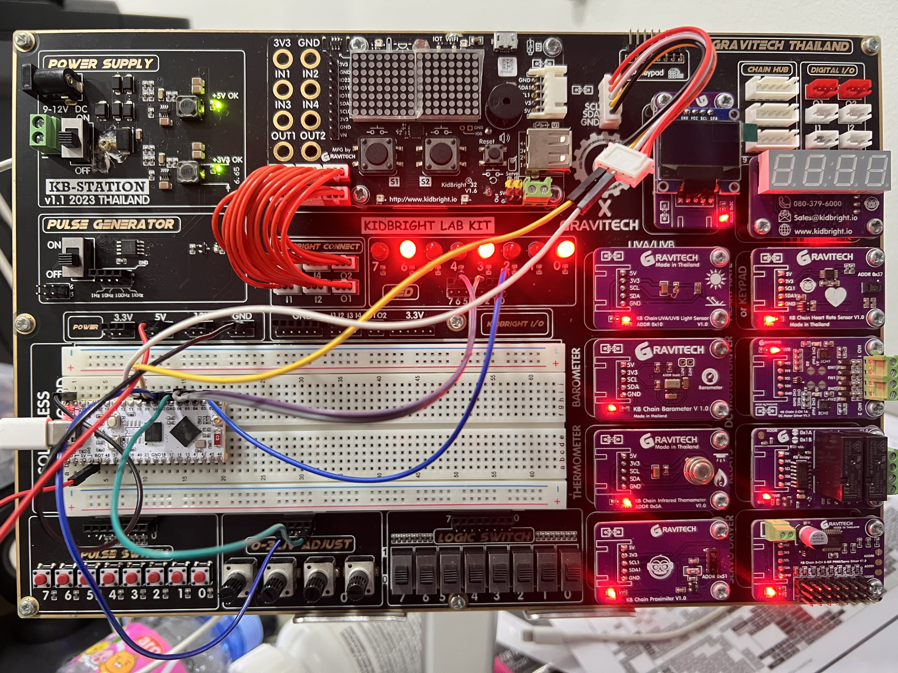
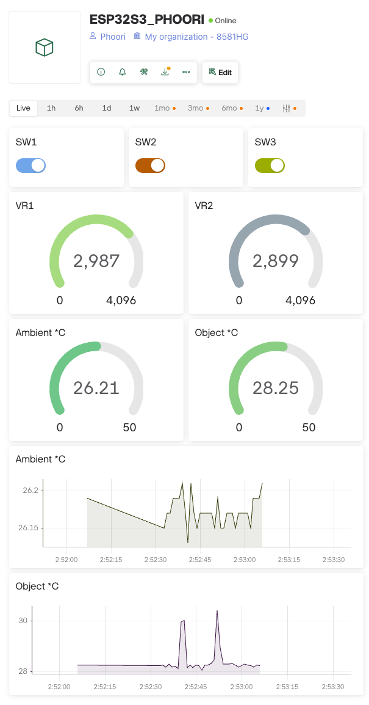
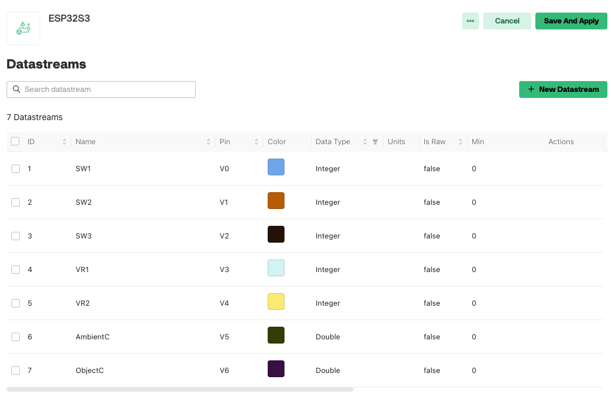

# 🧪 โจทย์สอบปฏิบัติ: ESP32-S3 + Blynk IoT

<div align="center">

### 📚 นักศึกษา สาขาวิชาวิศวกรรมเครื่องกล ME6831
### 🏛️ มหาวิทยาลัยกาฬสินธุ์
### 📅 ประจำภาคการศึกษา 1/2568
### 👨‍🏫 อาจารย์ผู้สอน: ภูริ จันทิมา

---

**หัวข้อ**: ESP32-S3 + Blynk Cloud + LED Control + Sensors (VR & MLX90614)

</div>

---

## 🎯 วัตถุประสงค์

<table>
<tr>
<td width="50">1️⃣</td>
<td>ตั้งค่าและเชื่อมต่อ <b>ESP32-S3</b> กับ <b>Blynk Cloud</b></td>
</tr>
<tr>
<td>2️⃣</td>
<td>ควบคุมเอาต์พุต <b>LED 3 ดวง</b> ผ่าน Virtual Pins</td>
</tr>
<tr>
<td>3️⃣</td>
<td>อ่านค่าอนาล็อกจาก <b>VR (Potentiometer) 2 ตัว</b></td>
</tr>
<tr>
<td>4️⃣</td>
<td>อ่านอุณหภูมิจาก <b>MLX90614</b> (Ambient & Object) ผ่าน I²C</td>
</tr>
<tr>
<td>5️⃣</td>
<td>ออกแบบหน้าแดชบอร์ด Blynk พร้อม <b>Widgets และ Real-time Charts</b></td>
</tr>
</table>

---

## 🔧 ฮาร์ดแวร์ที่ใช้

### ตัวอย่างการต่อวงจรจริง


*รูปที่ 1: ตัวอย่างการต่อวงจร ESP32-S3 + LEDs + VR + MLX90614 บน KB-STATION*

### 📦 อุปกรณ์หลัก

| ลำดับ | อุปกรณ์ | จำนวน | รายละเอียด |
|:---:|---------|:-----:|-----------|
| 1 | ESP32-S3 DevKit | 1 ชุด | N16R8 (16MB Flash, 8MB PSRAM) |
| 2 | LED | 3 ดวง | สีแดง/เหลือง/เขียว (หรือโมดูลรีเลย์) |
| 3 | Variable Resistor (VR) | 2 ตัว | 10kΩ Potentiometer |
| 4 | MLX90614 | 1 ตัว | เซ็นเซอร์อุณหภูมิแบบไม่สัมผัส (I²C) |
| 5 | สายจัมเปอร์ | ตามต้องการ | Male-Male, Male-Female |


### 🔌 Pin Configuration (ESP32-S3)

<table>
<thead>
<tr>
<th width="200">อุปกรณ์</th>
<th width="120">GPIO Pin</th>
<th width="120">สี LED</th>
<th>หมายเหตุ</th>
</tr>
</thead>
<tbody>
<tr style="background-color: #ffe6e6;">
<td>💡 <b>LED 1</b></td>
<td><code>GPIO 2</code></td>

</tr>
<tr style="background-color: #fff9e6;">
<td>💡 <b>LED 2</b></td>
<td><code>GPIO 4</code></td>

</tr>
<tr style="background-color: #e6ffe6;">
<td>💡 <b>LED 3</b></td>
<td><code>GPIO 5</code></td>

</tr>
<tr>
<td>🎛️ <b>VR1</b> (Potentiometer 1)</td>
<td><code>GPIO 6</code></td>

</tr>
<tr>
<td>🎛️ <b>VR2</b> (Potentiometer 2)</td>
<td><code>GPIO 7</code></td>

</tr>
<tr style="background-color: #e6f3ff;">
<td>🌡️ <b>MLX90614</b> SDA</td>
<td><code>GPIO 8</code></td>
</tr>
<tr style="background-color: #e6f3ff;">
<td>🌡️ <b>MLX90614</b> SCL</td>
<td><code>GPIO 9</code></td>
</tr>
</tbody>
</table> 

---

## 📋 งานที่ต้องทำ

### 1️⃣ ต่อวงจรและความปลอดภัย
- ต่อวงจรตาม Pin Configuration ข้างต้น
- ตรวจสอบการต่อสายให้ถูกต้อง

### 2️⃣ ตั้งค่า Arduino IDE

#### ⚙️ การตั้งค่าบอร์ด

| พารามิเตอร์ | ค่าที่ตั้ง |
|------------|-----------|
| 🔧 **Board** | `ESP32S3 Dev Module` |
| 💾 **Flash Size** | `16MB` |
| 🧠 **PSRAM** | `Enabled` (OPI PSRAM) |
| 🔌 **USB CDC On Boot** | `Enabled` |
| ⚡ **Upload Speed** | `921600` |
| 🚀 **CPU Frequency** | `240MHz (WiFi)` |
| 📡 **Core Debug Level** | `None` (หรือ Info สำหรับ debug) |

#### 📚 ติดตั้ง Libraries

<table>
<tr>
<th width="50">ลำดับ</th>
<th>Library Name</th>
<th>ผู้พัฒนา</th>
<th>เวอร์ชันแนะนำ</th>
</tr>
<tr>
<td align="center">1</td>
<td><code>Blynk</code></td>
<td>Volodymyr Shymanskyy</td>
<td>≥ 1.3.2</td>
</tr>
<tr>
<td align="center">2</td>
<td><code>Adafruit MLX90614 Library</code></td>
<td>Adafruit</td>
<td>≥ 2.1.3</td>
</tr>
<tr>
<td align="center">3</td>
<td><code>Adafruit BusIO</code></td>
<td>Adafruit</td>
<td>≥ 1.14.5</td>
</tr>
</table>

**📥 วิธีติดตั้ง:**
```arduino
Arduino IDE → Sketch → Include Library → Manage Libraries
→ ค้นหาชื่อ Library → คลิก Install
```

### 3️⃣ เชื่อมต่อ Blynk Cloud

#### 🌐 ขั้นตอนการสร้าง Template


**📝 ขั้นตอนละเอียด:**

1. **เข้าสู่ระบบ** → [Blynk Cloud Console](https://blynk.cloud/)
2. **สร้าง Template** → คลิก `+ New Template`
3. **กรอกข้อมูล:**
   - 📛 **Name**: `ESP32S3_<ชื่อของคุณ>`
   - 🔧 **Hardware**: `ESP32`
   - 📡 **Connection Type**: `WiFi`
4. **บันทึกข้อมูลสำคัญ:**
   ```cpp
   BLYNK_TEMPLATE_ID     "TMPLxxxxxx"
   BLYNK_TEMPLATE_NAME   "ESP32S3_YourName"
   BLYNK_AUTH_TOKEN      "abcdefgh-1234567890"
   ```
5. **ตั้งค่า Datastreams** → เพิ่ม Virtual Pins ตามตารางด้านล่าง

### 4️⃣ เขียนโค้ดให้ทำงานครบ

#### 📍 Virtual Pins Assignment

<table>
<thead>
<tr>
<th width="100">Virtual Pin</th>
<th width="250">ฟังก์ชัน</th>
<th width="120">ทิศทาง</th>
<th width="100">Data Type</th>
<th>ช่วงค่า</th>
</tr>
</thead>
<tbody>
<tr style="background-color: #fff3e0;">
<td align="center"><code>V0</code></td>
<td>🔴 ควบคุม LED1 (GPIO2)</td>
<td>⬅️ Input</td>
<td>Integer</td>
<td>0-1</td>
</tr>
<tr style="background-color: #fff3e0;">
<td align="center"><code>V1</code></td>
<td>🟡 ควบคุม LED2 (GPIO4)</td>
<td>⬅️ Input</td>
<td>Integer</td>
<td>0-1</td>
</tr>
<tr style="background-color: #fff3e0;">
<td align="center"><code>V2</code></td>
<td>🟢 ควบคุม LED3 (GPIO5)</td>
<td>⬅️ Input</td>
<td>Integer</td>
<td>0-1</td>
</tr>
<tr style="background-color: #e3f2fd;">
<td align="center"><code>V3</code></td>
<td>🎛️ แสดงค่า VR1</td>
<td>➡️ Output</td>
<td>Integer</td>
<td>0-4095</td>
</tr>
<tr style="background-color: #e3f2fd;">
<td align="center"><code>V4</code></td>
<td>🎛️ แสดงค่า VR2</td>
<td>➡️ Output</td>
<td>Integer</td>
<td>0-4095</td>
</tr>
<tr style="background-color: #f3e5f5;">
<td align="center"><code>V5</code></td>
<td>🌡️ อุณหภูมิ Ambient (°C)</td>
<td>➡️ Output</td>
<td>Double</td>
<td>0-50</td>
</tr>
<tr style="background-color: #f3e5f5;">
<td align="center"><code>V6</code></td>
<td>🌡️ อุณหภูมิ Object (°C)</td>
<td>➡️ Output</td>
<td>Double</td>
<td>0-100</td>
</tr>
</tbody>
</table>

#### 📝 โครงสร้างโค้ด

```cpp
// ✅ ส่วนประกอบหลักที่ต้องมี:

// 1️⃣ Wi-Fi Connection
   ├── WiFi.begin(ssid, password)
   ├── WiFi.status() check
   └── Auto-reconnect mechanism

// 2️⃣ Blynk Connection
   ├── Blynk.config(auth)
   ├── Blynk.connect()
   └── Blynk.connected() check

// 3️⃣ LED Control (BLYNK_WRITE)
   ├── BLYNK_WRITE(V0) → digitalWrite(LED1)
   ├── BLYNK_WRITE(V1) → digitalWrite(LED2)
   └── BLYNK_WRITE(V2) → digitalWrite(LED3)

// 4️⃣ Read Analog Values
   ├── analogRead(VR1_PIN) → V3
   └── analogRead(VR2_PIN) → V4

// 5️⃣ Read MLX90614 (I²C)
   ├── mlx.readAmbientTempC() → V5
   └── mlx.readObjectTempC() → V6

// 6️⃣ Send to Blynk
   └── Blynk.virtualWrite(Vx, value)

// 7️⃣ Serial Debug
   └── Serial.println() messages
```

**💡 เทคนิคการเขียนโค้ด:**
- ใช้ `BlynkTimer` สำหรับอ่านเซ็นเซอร์ (ทุก 1-2 วินาที)
- ตรวจสอบ `Blynk.connected()` ก่อนส่งข้อมูล
- เพิ่ม `Serial.println()` เพื่อ debug
- ใช้ `delay()` น้อยที่สุด ให้ใช้ `timer` แทน

### 5. ออกแบบแดชบอร์ด Blynk

#### ตัวอย่าง Blynk Dashboard


*รูปที่ 2: ตัวอย่าง Blynk Dashboard พร้อม Widgets และ Charts*

#### ตัวอย่าง Datastreams Configuration


*รูปที่ 3: การตั้งค่า Datastreams (Virtual Pins V0-V6)*

#### 🎨 Widget ที่ต้องมี (บังคับ)

<table>
<thead>
<tr>
<th width="150">Widget Type</th>
<th width="120">Virtual Pin</th>
<th width="200">Label/ชื่อ</th>
<th>การตั้งค่า</th>
</tr>
</thead>
<tbody>
<tr style="background-color: #ffebee;">
<td>🔘 <b>Switch</b></td>
<td><code>V0</code></td>
<td>SW1 (LED Red)</td>
<td>Mode: Switch, Color: Red</td>
</tr>
<tr style="background-color: #fffde7;">
<td>🔘 <b>Switch</b></td>
<td><code>V1</code></td>
<td>SW2 (LED Yellow)</td>
<td>Mode: Switch, Color: Orange</td>
</tr>
<tr style="background-color: #e8f5e9;">
<td>🔘 <b>Switch</b></td>
<td><code>V2</code></td>
<td>SW3 (LED Green)</td>
<td>Mode: Switch, Color: Green</td>
</tr>
<tr style="background-color: #e1f5fe;">
<td>📊 <b>Gauge</b></td>
<td><code>V3</code></td>
<td>VR1</td>
<td>Min: 0, Max: 4096, Reading Rate: PUSH</td>
</tr>
<tr style="background-color: #e1f5fe;">
<td>📊 <b>Gauge</b></td>
<td><code>V4</code></td>
<td>VR2</td>
<td>Min: 0, Max: 4096, Reading Rate: PUSH</td>
</tr>
<tr style="background-color: #fce4ec;">
<td>🌡️ <b>Gauge</b></td>
<td><code>V5</code></td>
<td>Ambient °C</td>
<td>Min: 0, Max: 50, Units: °C</td>
</tr>
<tr style="background-color: #fce4ec;">
<td>🌡️ <b>Gauge</b></td>
<td><code>V6</code></td>
<td>Object °C</td>
<td>Min: 0, Max: 50, Units: °C</td>
</tr>
<tr style="background-color: #f3e5f5;">
<td>📈 <b>Chart</b></td>
<td><code>V5</code></td>
<td>Ambient °C</td>
<td>Time Range: 1h, Update: 1s</td>
</tr>
<tr style="background-color: #f3e5f5;">
<td>📈 <b>Chart</b></td>
<td><code>V6</code></td>
<td>Object °C</td>
<td>Time Range: 1h, Update: 1s</td>
</tr>
</tbody>
</table>

**📌 การตั้งค่า Widget แนะนำ:**
- ✅ **Update Interval**: 1-2 วินาที
- ✅ **Reading Rate**: PUSH (ให้ ESP32 ส่งข้อมูลเอง)
- ✅ **Time Range** (Chart): 1 hour
- ✅ **Label**: ใช้ภาษาไทยหรืออังกฤษที่เข้าใจง่าย

---

## 📊 เกณฑ์การให้คะแนน (รวม 15 คะแนน)

### หมวด A: การต่อวงจรและความเรียบร้อย (4 คะแนน)
- ✓ ต่อสายถูกต้องตามไดอะแกรม
- ✓ ใช้แรงดัน/กราวด์ร่วมอย่างเหมาะสม
- ✓ ใส่ตัวต้านทานให้ LED (ถ้าจำเป็น)
- ✓ จัดระเบียบสายให้เรียบร้อย
- ✓ เปิดใช้งานได้ปลอดภัย ไม่มีไฟลัดวงจร

### หมวด B: เชื่อมต่อ Wi-Fi & Blynk (2 คะแนน)
- ✓ Serial Monitor แสดง IP Address และสถานะการเชื่อมต่อ
- ✓ Blynk พร้อมใช้งาน (แสดง "Ready (ping: ...)")
- ✓ มีระบบ reconnect อัตโนมัติ

### หมวด C: ควบคุม LED ผ่าน Blynk (3 คะแนน)
- ✓ V0/V1/V2 ควบคุม GPIO 2/4/5 ได้จริง
- ✓ การทำงานเสถียร ไม่มีการกระพริบผิดปกติ
- ✓ มี Serial log เมื่อเปลี่ยนสถานะ LED

### หมวด D: อ่าน VR 2 ตัว (2 คะแนน)
- ✓ อ่านและส่ง V3/V4 ถูกต้อง
- ✓ ค่าเปลี่ยนแปลงตามการหมุน VR
- ✓ อัปเดตค่าอย่างต่อเนื่อง

### หมวด E: อ่าน MLX90614 (I²C) (2 คะแนน)
- ✓ อ่านค่า Ambient/Object ได้
- ✓ ส่งค่า V5/V6 ถูกต้อง
- ✓ ค่าอุณหภูมิมีความสมเหตุสมผล

### หมวด F: ออกแบบแดชบอร์ด Blynk (2 คะแนน)
- ✓ ตั้งชื่อ Dashboard ว่า ESP32S3_Name (*Name = ชื่อนักศึกษา*) 
- ✓ มีปุ่ม SW1–SW3 ครบถ้วน
- ✓ มีเกจ/ตัวเลข VR1/VR2
- ✓ มีเกจอุณหภูมิ (Ambient/Object)
- ✓ มีกราฟอย่างน้อย Ambient/Object
- ✓ ตั้งช่วงค่าเหมาะสม

---

## 📤 หลักฐานส่งงาน (Submission)

### ไฟล์ที่ต้องส่ง

1. **โค้ด .ino**
   - ไฟล์หลัก (ESP32_Name.ino) *** Name = ชื่อนักศึกษา ***

2. **สกรีนช็อตแดชบอร์ด Blynk**
   - ขณะอุปกรณ์ออนไลน์
   - แสดง Widget ทั้งหมดที่ใช้งาน
   - แสดงกราฟที่มีข้อมูลจริง

3. **รูปถ่ายวงจร**
   - มุมกว้างให้เห็นการต่อครบทุกโมดูล
   - ถ่ายให้เห็นการต่อสายชัดเจน
   - แสดง LED ที่ทำงานจริง

### ตัวอย่างภาพประกอบ

#### 1. การต่อวงจรบน Breadboard


#### 2. Blynk Dashboard ที่ใช้งานจริง


#### 3. การตั้งค่า Virtual Pins (Datastreams)


### 💡 เคล็ดลับการทำข้อสอบ

<table>
<tr>
<td width="50">1️⃣</td>
<td width="250"><b>ทดสอบการต่อวงจรก่อนเขียนโค้ด</b></td>
<td>
• ทดสอบ LED ด้วยโค้ด Blink อง่ายๆ<br>
• ตรวจสอบแรงดันด้วย Multimeter<br>
• ตรวจสอบโพลาริตี้ของ LED
</td>
</tr>
<tr>
<td>2️⃣</td>
<td><b>ทดสอบทีละโมดูล</b></td>
<td>
LED → VR → MLX90614 → Blynk<br>
(ทดสอบทีละส่วนก่อนรวมเป็นโปรเจคใหญ่)
</td>
</tr>
<tr>
<td>3️⃣</td>
<td><b>ใช้ Serial Monitor ตรวจสอบ</b></td>
<td>
• เปิดบอร์ดเรต 115200<br>
• ดูค่าที่อ่านได้จริง<br>
• ตรวจสอบสถานะ Wi-Fi/Blynk
</td>
</tr>
<tr>
<td>4️⃣</td>
<td><b>จัดการ Blynk Template ให้เรียบร้อย</b></td>
<td>
• บันทึก Auth Token ไว้ในที่ปลอดภัย<br>
• ตั้งค่า Datastreams ก่อนเขียนโค้ด<br>
• ตรวจสอบ Virtual Pin ให้ตรงกัน
</td>
</tr>
<tr>
<td>5️⃣</td>
<td><b>ทำแดชบอร์ดให้สวยงาม</b></td>
<td>
• จัดวาง Widget ให้เป็นระเบียบ<br>
• ใส่ Label ที่ชัดเจน เข้าใจง่าย<br>
• เลือกสีที่เหมาะสมกับแต่ละ Widget
</td>
</tr>
</table>

---

## � ติดต่อ & สนับสนุน

<div align="center">

### 👨‍🏫 อาจารย์ภูริ จันทิมา

📱 **โทรศัพท์**: [087-2273357](tel:0872273357)

📧 **อีเมล**: [phoori.ch@ksu.ac.th]

🏛️ **สาขาวิชา**: วิศวกรรมคอมพิวเตอร์ฺ 
มหาวิทยาลัยกาฬสินธุ์

---

### 🎓 ขอให้นักศึกษาทุกคนสอบให้สนุกและประสบความสำเร็จ! 🚀

**"การเรียนรู้ IoT คือการเชื่อมต่ออนาคต"** �

---

<sub>เอกสารนี้จัดทำขึ้นเพื่อการศึกษา | อัปเดตล่าสุด: ภาคการศึกษา 1/2568</sub>

</div>
